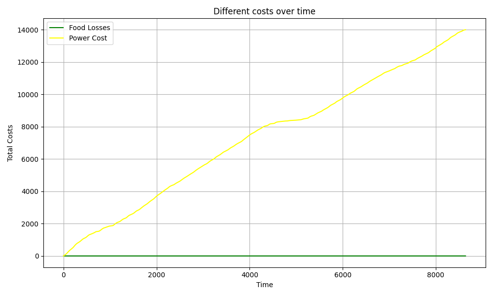
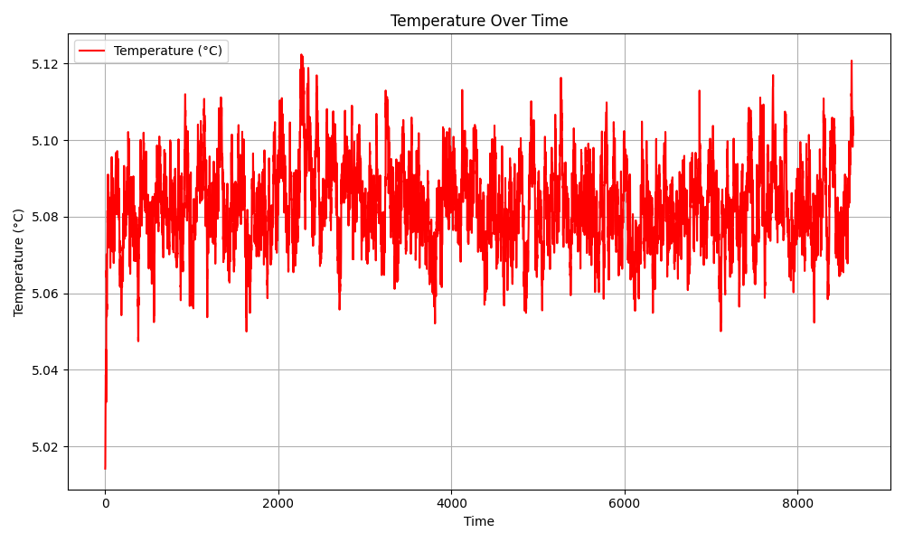
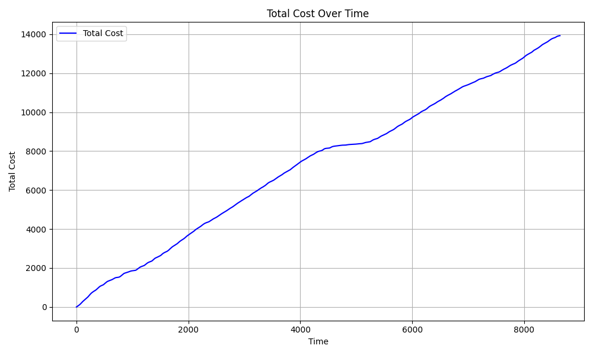
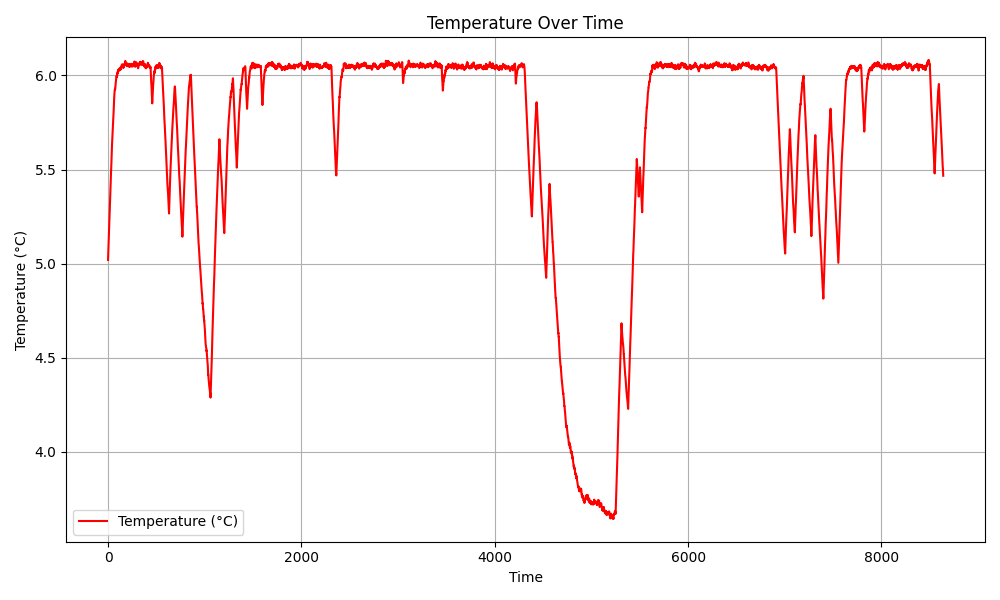
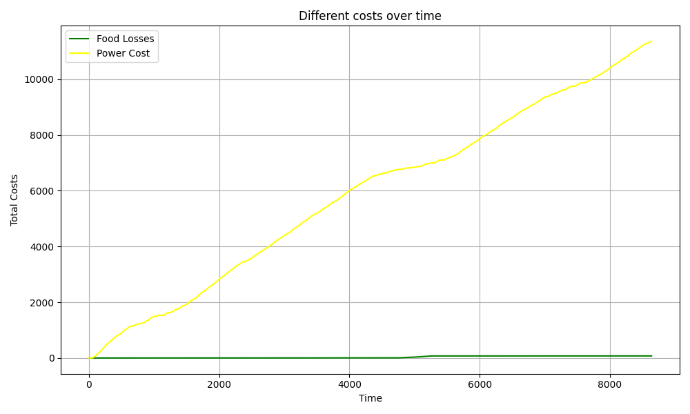
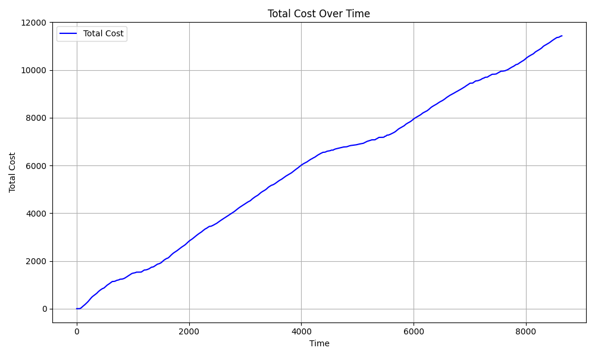
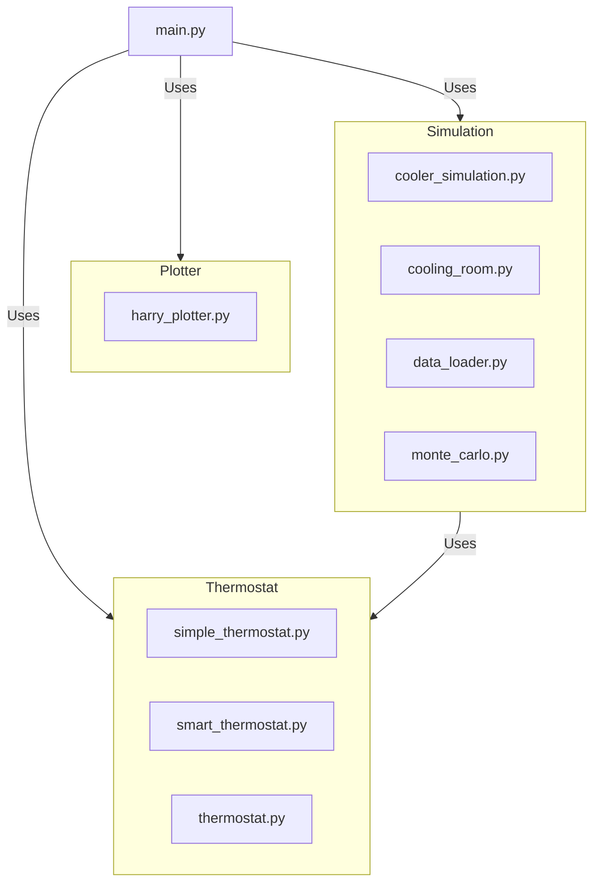

# Workshop 2: Kølerum

## Termostater

### Simple termostat



med den simple termostat får jeg et gennemsnit efter 1000 simulationer på 13899 kr. Dette kan dog godt varirer med plus minus 100 kr hver gang. 
### Intelligent termostat
her har jeg implemeteret en thermostat der køber hvis prisen er billig og tillader temparaturen til at stige til 6 før den tænder igen hvis prisen bliver billigere end 2 kr tænder den for kompressoren. 

```python
def compressor_decide(self, interval: int) -> bool:
    # Get the current price and temperature
    price = float(self.cooling_room.price_data.iloc[interval])
    current_temp = self.cooling_room.temperature

    price_threshold = 2  # Adjust this threshold based on desired behavior
    temperature_threshold = 6  # Critical temperature threshold
    lowest_temp = 3.5 # Critical Low temperature threshold
        
    if current_temp >= temperature_threshold or price < price_threshold and current_temp > lowest_temp:
        return True  # Turn compressor on
    else:
        return False  # Turn compressor off
```

over her kan funktion for smart termostaten ses den tager self og interval og returnere en boolean. Først tager den prisen for det tidspunkt og lægger ind i variabelen price. Derefter tager den nuværende temperatur for kølerummet. 
Derefter laves der to varaible der indholder forskellige værdi for hvornår temparaturen skal ændres som bruges nedunder i if statementen. 
Hvis den nuværende temparatur er større ind den maksimale temparatur der tillades så tænd kompressoren ellers hvis pris er under den 2 og temparaturen er over minimus temparatur så tænd ellers sluk kompressoren.

#### Resultat



på graferne over kan man se resultatet af 1000 simulation at den smarte termostat den totale pris bliver 11427 kr så billigere ind den simple termostat og er indefor det månedlige budget som restauranten har til el og madspild. man kan hurtig se på temparatur graferne at tempaturen variere mere end den simple termostat og der er et stort fald ved tid 4000 til 6000. Som er fordi at prisen på el er billig på det tidspunkt, der kan også ses at vi holder tempartuen omkring 6 grader hvor den simple er omkring 5 grader. Der er også et meget lidt madspild grundet at der køles for meget når prisen er billig her kan lowest_temp justeres til at undgå dette. 

## Kode

### Layout


I dette projekt har jeg prøvet at følge Python Standards så godt jeg nu lige kunne og prøvet at lave koden så modulær som muligt dette kan også ses projekt strukturen. Det kunne godt gøres bedre ved at dele cooling_room.py til sit eget modul. Synes dog det forvirer mere ind det gavner generelt de et lille projekt som dette ved jeg ikke hvor meget det giver med denne struktur da det godt kan blive forvirerne med alle de filer og mapper. 

### Thermostat modul

```python
from abc import ABC, abstractmethod
from simulation.cooling_room import CoolingRoom
class Thermostat(ABC):
    """
    This is Base Thermostat class for managing temperature control
    """
    def __init__(self):
        """
        Initialize the thermostat with a target temperature. 
        """
        self.cooling_room: CoolingRoom | None = None


    def register(self, room: "CoolingRoom") -> None:
        """
        Register the thermostat in the room
        :param room: CoolingRoom to register the thermostat
        :return: None
        """
        assert isinstance(
            room, CoolingRoom
        ), "The thermostat can only be registered in a CoolingRoom"
        self.cooling_room = room

    @abstractmethod
    def compressor_decide(self):
        """
        This function decides whether the compressor should be on or off
        :param current_temp: Current room temperature
        :return: Bool if True then turn on and False then turn off 
        """
        raise NotImplementedError("This method should be overridden by subclasses to decide state of compressor")
```

Dette kode er base klassen for thermostat modulet så er simple_thermostat og smart_thermostat subklasse af denne. Dette design som ses følger principper for polymorfi, hvilket gør det nemt at videre udvikle flere typer af termostater. 

som der kan ses har vi funktion register som bruges til at lave et instans af kølerums koden så variabler som tempartur, interval og pris data kan bruges i termostaterne til at bedre bestemme om kompressoren skal være tændt eller slukket. 
vi har også en funktion compressor_decide som skal bestemme om kompressoren skal være tændt eller slukket. Den er markeret med @abstractmethod hvilket betyder at alle underklasse skal have en implemetion af denne funktion.

### Monte Carlo simulering
```python
class MonteCarloSim:
    def __init__(self) -> None:
        self.price_loader = DataLoader()
        

    def run_simulation(self, thermostat, samples: int) -> pd.Series:
        self.price_loader.load_data("./data/elpris.csv")

        # Get prices as a pandas Series
        price_data = self.price_loader.get_prices()

        # stores all the simulation results
        all_data = []

        for _ in range(samples):
            # Reset the cooling room for each sample 
            cooling_room = CoolingRoom(
                thermostat=thermostat, 
                food=Food(), 
                price_data=price_data
            )
            
            simulation = CoolerSimulation(cooling_room)
            
            # Runs the simulation and store the result
            sample_data = simulation.run_simulation()
            # adds new data to all_data list
            all_data.append(sample_data)

        # Calculate the average of all samples
        all_data_df = pd.concat(all_data, axis=0)
        average_data_df = all_data_df.groupby(all_data_df.index).mean()

        #print(average_data_df)
        
        return average_data_df
```
Over her kan klassen der håndtere monte carlo simulering det funktion "run_simulation" som tager thermostat og samples som input. thermostat er den version af termostat klassen man bruger og samples er hvor mange gange man vil kører simulation. Først i denne funktion tager vi og loader priserne ind fra csv filen og putter det så ind i en variabel. herefter laves en liste som indholde alle dataframes for hver simulation.

herefter er der et for loop som køre de samples man har sat det første der sker i dette for loop er at vi laver et instans af CoolingRoom klassen med de parameter som skal bruges. herfer laver vi et instans af CoolerSimulation som tager instanset der blev lavet før af CoolingRoom som parameter. Herefter bruger vi funktion af simulation klassen run_simulation som kører CoolerSimulation og returner en Dataframe med relevante værdier. Dette bliver så puttet ind i listen all_data 

Efter for loopet bruges pd.concat til at samle alt dataen i en dataframe. Herefter bliver der lavet en dataframe der indholder gennemsnittet af alle simulationer ved at gruppe alle dataframesne udfra index og der efter finde gennemsnittet af hver colum med det index. Dette bliver så returneret
